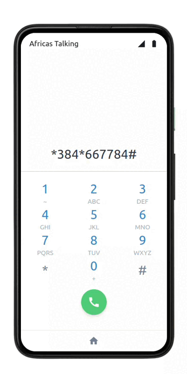

# USSD Application

This is simple ussd application that demonstrates how django can be used to build ussd applications.

## Preview

## What I learnt

- How ussd applications function.
- How django can be used to build ussd apps.

## PS

- In order for you to test this app. you will need an [africastalking](https://africastalking.com/) account.

- You can also follow this [article](https://alaminmusamagaga.medium.com/build-ussd-with-python-and-django-882ed03f789)
  on how to build ussd applications.
